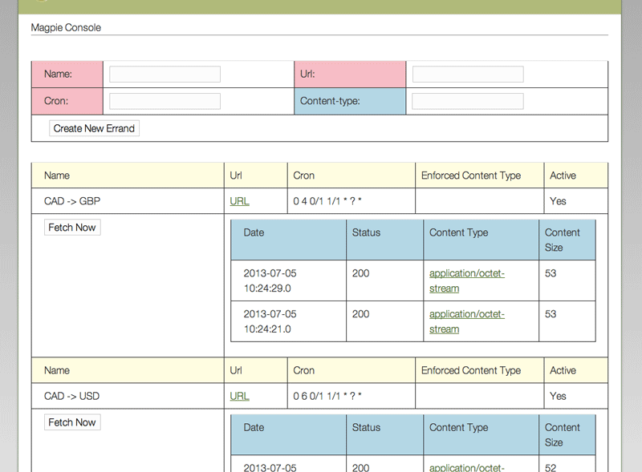

About the 'Magpie' Grails Plugin
=============================

 

This plugin offers scheduled fetching of any http content (via GET), which is then timestamped and persisted; for instance, you may be keeping a list of current exchange rates where you have single URL for each currency pair; or perhaps you want grab a daily weather map.

There are only two domain classes in this plugin: 

* [Errand](https://github.com/erasmos/magpie-grails-plugin/blob/master/grails-app/domain/com/erasmos/grails/magpie_plugin/Errand.groovy): Which defines the scheduled task of getting the contents for a specified URL; the fields are:
     * *URL*: The mandatory target URL which we'll use for the GET.
     * *Name*: A unique name, for internal reference only; mandatory.
     * *CronExpression*: The cron expression which defines the schedule for the fetching; I'd recommend [CronMaker](http://www.cronmaker.com/) for generation; mandatory.
     * *EnforcedContentTypeForRendering*: Optional; only relevant to the plugin's Console, described below; it overrides the actual ContentType of the Fetch to faciliate display; for example, a CSV file might have been returned with a ContentType of 'application/octet-stream', but you'd rather view it as 'text/csv'.
     * *Active*: A flag indicating whether or not to Fetch it; it's initially 'true'.
          
* [Fetch](https://github.com/erasmos/magpie-grails-plugin/blob/master/grails-app/domain/com/erasmos/grails/magpie_plugin/Fetch.groovy): Defines the act of getting this content; belongs to an Errand which can have many of them; the fields are:
     * *Content*: The raw, binary contents of the resource.
     * *ContentType*: As described by the response header.
     * *HttpStatusCode*: The [status code](http://www.w3.org/Protocols/rfc2616/rfc2616-sec10.html) from the response header.
     * *DateCreated*: Automatic timestamp.  
     
     
The 'external' interface is the [MagpieService](https://github.com/erasmos/magpie-grails-plugin/blob/master/grails-app/services/com/erasmos/grails/magpie_plugin/MagpieService.groovy), with which you can:

**Create a New Errand**

     Errand createNewErrand(final String name,final URL url, final String cronExpression, final String enforcedContentTypeForRendering = null) throws InvalidProposedErrandException
     
     
**Manually Fetch an Errand**

     Fetch fetch(final Errand errand) throws ErrandNotEligibleForFetch     
     

**Find an Errand By Name**

       Errand findErrandByName(final String name)
 
**Activate an Errand**

       boolean activate(final Errand errand)
       
**Deactivate an Errand**

	   boolean deactivate(final Errand errand) 
 
 
Internally, there are three other Services - which you might find useful.

The [JobService](https://github.com/erasmos/magpie-grails-plugin/blob/master/grails-app/services/com/erasmos/grails/magpie_plugin/JobService.groovy) is a thin wrapper for the [Quartz Scheduler](http://grails.org/plugin/quartz); you can:

**Add a Job for an Errand**

    void addJob(final Errand errand) throws JobServiceException
 
 
**See if a Job Already Exists for a (Errand)xName**

    boolean doesJobExist(final String jobName)
    
    
The [FetchService](https://github.com/erasmos/magpie-grails-plugin/blob/master/grails-app/services/com/erasmos/grails/magpie_plugin/FetchService.groovy) is a thin wrapper around [HttpClient](http://hc.apache.org/httpclient-3.x/), and has only a single public method - fetch - which returns a value object containing the ContentType, Content, and Http Status Code.

    FetchService.Response fetch(final URL url)
     
    
Finally, we have the [EventService](https://github.com/erasmos/magpie-grails-plugin/blob/master/grails-app/services/com/erasmos/grails/magpie_plugin/EventService.groovy) - based on [Spring Events](http://grails.org/plugin/spring-events)-  which publishes two events: NewErrandEvent and NewFetchEvent; each event contains it's respective entity as 'source'; in order to receive these events your class need only implement the ApplicationListener<EventService.MagpieEvent> interface; I've included [DefaultEventListenerService](https://github.com/erasmos/magpie-grails-plugin/blob/master/grails-app/services/com/erasmos/grails/magpie_plugin/DefaultEventListenerService.groovy) which can be used as an example. There's only one call back method:

      void onApplicationEvent(EventService.MagpieEvent event)
  
  
Once the plugin is included in your app, there is a basic admin console provided at /magpieConsole; referring to the screen grab below we can see the following:

* At top, there's a form where you add a new Errand; remember that the name has to be unique; all the pink fields are mandatory.

* We have several Errands already, all related to currency pairs; to take the topmost on as an example, this is presumedly a URL which returns the current exchange rate of one Canadian Dollar to British Pounds; the URL is not displayed, but is revealed by the linked 'URL'; according to the Cron Expression is runs on the fourth minute of each hour; there is no enforced Content Type; and finally, it is currently active.

* For each Errand, we have a listing of the various Fetches that have already taken place, each with a timestamp, http status code, content size, and the content type, which is linked to the actual content.

* For each Errand, we also have a 'Fetch Now' button which will manually Fetch the content for that Errand.

Please note that there is currently no means of deactivating or reactivating a given Errand from the Console; this must be done via the relevant methods on MagpieService, described above.

In making this console, I added a Restful API that you might find useful as well; there are several methods:

**Overview** (GET: /restfulMagpie)

Gives the number of Errands and Fetches, as well as links to each list.

		
		{
		"numberOfErrands": 6,
		"numberOfFetches": 9,
		"links": {
		  "allErrands": "http://localhost:8080/magpie-grails-plugin-demo/restfulMagpie/errands",
		  "allFetches": "http://localhost:8080/magpie-grails-plugin-demo/restfulMagpie/fetches"
		  }
		}

**List of all Errands** (GET: /restfulMagpie/errands)

Gives a list of all of the Errands, each with links, as in this example:

		{
		"id": 4,
		"name": "CAD -> GBP",
		"url": "http://download.finance.yahoo.com/d/quotes.cvs?f=sl1d1t1ba&e=.csv&s=CADGBP=X",
		"cronExpression": "0 4 0/1 1/1 * ? *",
		"enforcedContentTypeForRendering": null,
		"active": true,
		"numberOfFetches": 2,
		"links": {
		"fetches": "http://localhost:8080/magpie-grails-plugin-demo/restfulMagpie/errands/4/fetches",
		"allErrands": "http://localhost:8080/magpie-grails-plugin-demo/restfulMagpie/errands"
		}
		},

**List of all Fetches** (GET: /restfulMagpie/fetches)

Gives a list of all of the Fetches, each with links, as in this example:

		{
		"id": 3,
		"errandId": 4,
		"errandName": "CAD -> GBP",
		"errandEnforcedContentTypeForRendering": null,
		"date": "2013-07-05 10:24:29.0",
		"httpStatusCode": 200,
		"contentType": "application/octet-stream",
		"contentSize": 53,
		"links": {
		   "errand": "http://localhost:8080/magpie-grails-plugin-demo/restfulMagpie/errands/4",
		  "contents": "http://localhost:8080/magpie-grails-plugin-demo/restfulMagpie/fetches/3/contents"
		  }
		},
  
  
Note that the contents link will present the contents with the enforced Content Type if declared; otherwise it will use the original one.   
  
**List of all Fetches for a Specific Errand** (/restfulMagpie/errands/4/fetches)

Presents a list of Fetches, as described directly above.

**Create a New Errand** (POST: /restfulMagpie/errands)

You can create a new Errand by posting the following values: 'name', 'url', 'cronExpression', and 'enforcedContentTypeForRendering'. If successful, a Location header will be returned pointing to the new Errand, for example: /restfulMagpie/errands/4.

**Manually Fetch an Errand** (POST: /restfulMagpie/errands/4/fetches)

This will manually create a Fetch for the specified Errand (id). If successful, a Location header will be returned pointing to the new Errand, for example: /restfulMagpie/errands/4.

---

Incidentally, I call it [Magpie](https://en.wikipedia.org/wiki/Eurasian_Magpie) as it reminds me of how these birds go out and (apparently) collect shiny things.

Hope that you find this to be useful,

[Sean Rasmussen](http://erasmos.com)
  